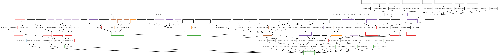

# Class Diagram Generator#

This document describes the functionality provided by the class diagram generator script.

See the **Deployit Reference Manual** for background information on Deployit and deployment concepts.

# Overview #

This script generates a [GraphViz](http://www.graphviz.org) file based on all the types defined in a deployit server.
# Requirements #

* **Deployit requirements**
	* **Deployit**: version 3.7
* [GraphViz](http://www.graphviz.org) any version. Put the dot executable file in your PATH

# Installation #

Download the Python script in your file system and run this command:

`<CLI_HOME>/bin/cli.sh -f <path-to-the-python-file/class_diagram_generator.py`

At the end, the script produces a file called `deployit-type-system.gv` describing the current type system using the Graphviz syntax. The script runs also the following command to transform the script into an PNG image

`dot -T png -o deployit-type-system.png  deployit-type-system.gv`

# Sample output #
[deployit-type-system.png](deployit-type-system.png)

  
	
