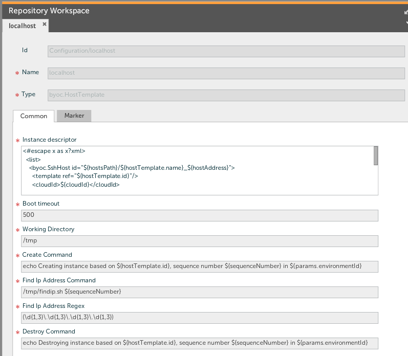

## Preface ##

This document describes the functionality provided by the Bring Your Own Cloud (BYOC) plugin.

Refer to **Deployit Reference Manual** for background information on Deployit and deployment concepts.

## Overview ##

The BYOC ("Bring Your Own Cloud") plugin is a Deployit plugin that builds on the Deployit 3.9+ Cloud Pack functionality to allow creation and teardown of images based on user-defined commands.

## Features ##

* Instantiate or destroy host templates via commands;
* Use Freemarker expressions in the commands to access the cloud template parameters.

# Requirements #

* **Deployit requirements**
	* **Deployit**: version 3.9+
	* **Other Deployit Plugins**: cloud-plugin

## Usage ##

The BYOC plugin extends on the cloud plugin in Deployit and is configured in a similar manner. For information on the cloud plugin, please see the [cloud plugin manual](http://docs.xebialabs.com/releases/3.9/cloud-plugin/cloudPluginManual.html).

The BYOC plugin adds the following types:

* `byoc.HostTemplate`, a host template that allows specifying a `createCommand` and `destroyCommand` and a `workingDirectory` where to execute them.
* `byoc.EnvironmentTemplate`, an environment template that contains, among others, hosts created by a BYOC host template.

The `createCommand` and `destroyCommand` on a host template are executed in the `workingDirectory` **locally on the Deployit server**. Commands are literal strings and do not support OS-specific special characters. To execute multiple commands, create a script, place it on the Deployit server and invoke it from the host template.

## Freemarker variables ##

Commands are run through freemarker before being executed. The following objects are availabe in the freemarker context:

* `hostTemplate` -- the host template instance that is being instantiated.
* `sequenceNumber` -- the sequence number of the host template within the environment template. Useful if you are instantiating the same host template multiple times in the same environment template.
* `params` -- the parameters specified at environment instantiation.

There are some examples in the Examples section.

## Determining the instance IP address ##

After the `createCommand` creates a new instance of the host template, Deployit will need to find out it's IP address. The BYOC plugin supports this via two properties, namely the `findIpAddressCommand` and the `findIpAddressRegex`.

The `findIpAddressCommand` is executed (locally on the Deployit server) to determine the IP address and print it to standard output. Deployit captures this output and applies the `findIpAddressRegex` regular expression to the command output to determine the IP address.

You can configure both properties for each host template.

## Examples ##

Here is an example `byoc.HostTemplate` instance that outputs some information when creating / destroying an instance.



The sample uses a `findip.sh` script to find the IP address. This script could, for instance, do the following:

```
#!/bin/sh

ifconfig | grep 10.0
```

With the right IP range for your Deployit server, this will output a line containing an IP address, which is picked up by the `findIpAddressRegex`.

If you want to ask the user for additional information when creating an environment template you can make the following change to the `cloud.CloudEnvironmentParameters`:

```
    <type-modification type="cloud.CloudEnvironmentParameters">
        <property name="instanceRAMSize" description="How much RAM do the new instances need?" label="RAM available to each new instance"/>
    </type-modification>
```

You can use parameters such as these in your command as follows:

```
echo Creating a new instance with RAM size: ${params.instanceRAMSize}
```

