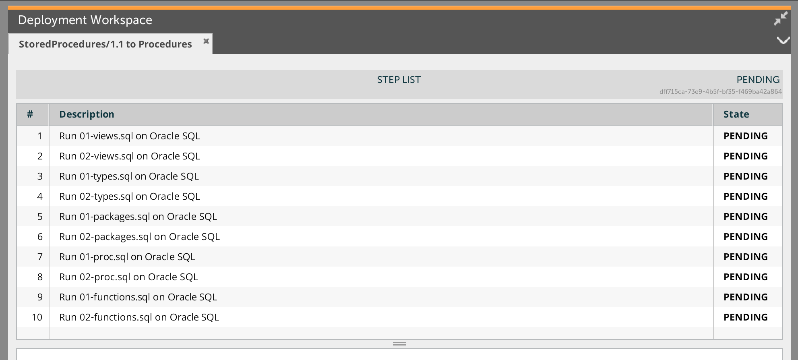

# Stored Procedures plugin #

This document describes the functionality provided by the stored procedures plugin.

See the **Deployit Reference Manual** for background information on Deployit and deployment concepts.

# Overview #


##Features##

* Package and Deploy SQL stored procedures (triggers, functions, procedures....)
* Default values are provided for Oracle Database, MySQL Database

# Requirements #

* **Deployit requirements**
	* **Deployit**: version 3.9+
	* need the database plugin (see available-plugins in the DEPLOYIT_SERVER_HOME)

# Installation

Place the plugin JAR file into your `SERVER_HOME/plugins` directory.

# Usage #

The stored procedures are packaged using a folder (`sql.StoredProcedures`) that should be set up like this.

```
<RootFolder>\Folder1
<RootFolder>\Folder1\01-file.to.be.executed.sql
<RootFolder>\Folder1\02-file.to.be.executed.sql
<RootFolder>\Folder1\03-file.to.be.executed.sql
<RootFolder>\Folder2
<RootFolder>\Folder2\01-file.to.be.executed.sql
<RootFolder>\Folder2\02-file.to.be.executed.sql
<RootFolder>\Folder13\03-file.to.be.executed.sql

<RootFolder>\Folder3

...
<RootFolder>\FolderX
```


The order in which the folder will be executed is given by the `folderSequence`. In our sample, the `folderSequence`is `Folder1,Folder2,Folder3,FolderX`.

In each folder, the execution order is provided by the `scriptRecognitionRegex` property whose default value is  `([0-9]*-.*)\.sql`.

For Oracle, the default folder sequence is: `views,types,packages,procedures,functions`.

For MySQL, the default folder sequence is: `triggers,procedures,functions`

# Screenshot #




